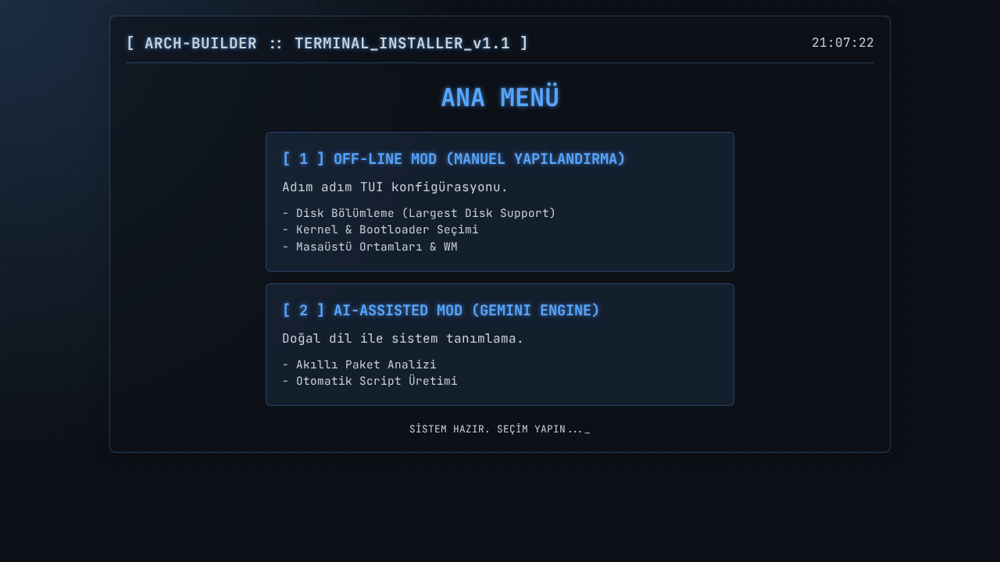
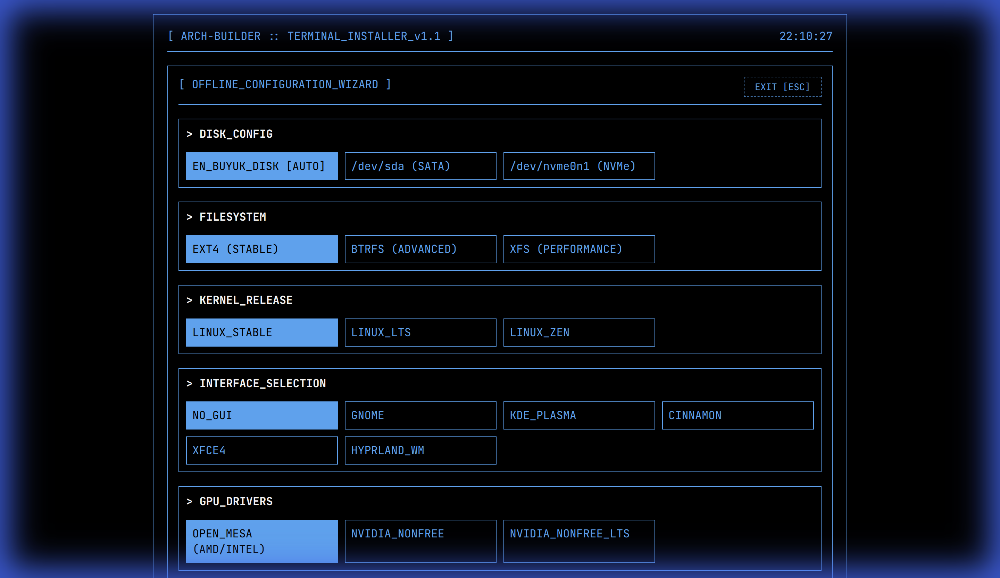

# 🏗️ ARCH-BUILDER v1.1 [TUI-READY]

**ARCH-BUILDER**, Arch Linux kurulum sürecini otomatize eden ve modern bir TUI estetiğiyle sunan gelişmiş bir script oluşturma platformudur.

---

## 📸 Görsel Önizleme

````carousel

<!-- slide -->

<!-- slide -->

<!-- slide -->

````

---

## ⚡ Hızlı Başlangıç

1.  **Backend'i Hazırlayın:**
    ```bash
    cd backend && npm install
    cp .env.example .env # API anahtarlarınızı ekleyin
    node server.js
    ```
2.  **Frontend'i Açın:** `frontend/index.html` dosyasını tarayıcınızda açın.

---

## 📚 Detaylı Dökümantasyon

Proje dökümantasyonu `docs/` klasörü altına taşınmıştır:

-   📄 **[Kullanım Kılavuzu & Özellikler](docs/README.md)**: Projenin tüm özelliklerini ve temel kurulum adımlarını içerir.
-   🏗️ **[Teknik Mimari (Architecture)](docs/ARCHITECTURE.md)**: AI çalışma mantığı, fallback mekanizmaları ve proje yapısı detayları.
-   ❓ **[Sıkça Sorulan Sorular (FAQ)](docs/FAQ.md)**: Genel sorular ve yanıtları.

---

## ⚠️ Uyarı
Üretilen scriptler sisteminizi formatlayabilir. Çalıştırmadan önce içeriği kontrol etmeyi unutmayın.

**Developed with ❤️ for Arch Linux Users.**
