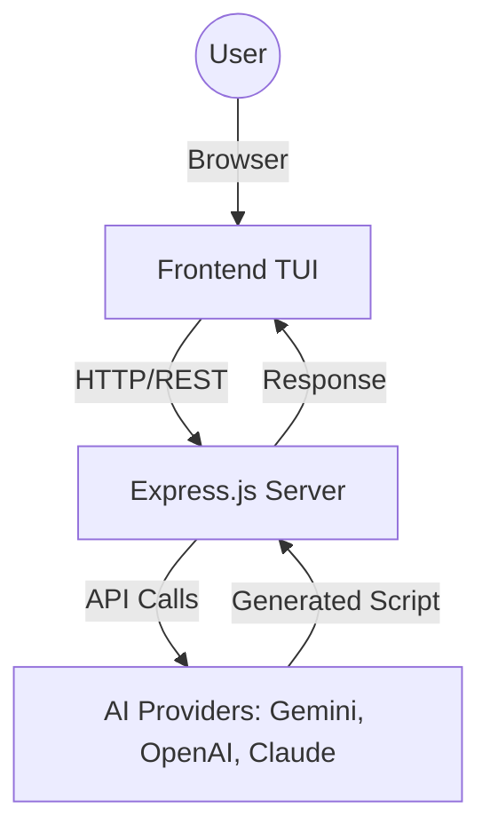

# 🏗️ ARCH-BUILDER Technical Architecture

This document describes the internal workings and design decisions of the Arch-Builder project.

## 📐 System Overview

Arch-Builder follows a classic **Client-Server** architecture tailored for a seamless Terminal User Interface (TUI) experience in the browser.



## 🧠 AI Generation Flow

The AI generation process is handled in `backend/routes/ai.js`. Key features include:

1.  **System Prompting:** A strict set of rules ensures the AI outputs and only outputs valid Bash scripts.
2.  **Model Fallback (Gemini):** If the preferred model (e.g., `gemini-2.0-flash`) fails or is throttled, the system automatically tries older or alternative versions in a predefined sequence.
3.  **Key Management:** Users can provide their own API keys via the TUI, which take precedence over the server's environment variables.
4.  **Cleaning:** The backend strips any accidental Markdown formatting (like ` ```bash ` tags) to ensure the script is raw and executable.

## 🎨 Frontend Design (TUI Aesthetics)

The frontend is built using Vanilla JS and CSS to minimize overhead and maximize the "retro terminal" feel.
- **`template-engine.js`**: A custom, lightweight logic to handle dynamic content injections.
- **`app.js` & `wizard.js`**: Handle state management for the manual configuration wizard.
- **`ai-mode.js`**: Manages the interaction with the AI backend.

## 🗂️ Directory Structure

- `/backend`: Node.js/Express environment.
- `/frontend`: Static assets (HTML, CSS, JS).
- `/docs`: Detailed documentation and technical guides.
- `/templates`: (Internal/Future) Pre-defined script snippets for manual mode.

## 🛠️ Environment Variables

The backend relies on several environment variables defined in `.env`:
- `GEMINI_API_KEY`: Default fallback key for Google Gemini.
- `OPENAI_API_KEY`: Default fallback key for OpenAI.
- `ANTHROPIC_API_KEY`: Default fallback key for Anthropic.
- `PORT`: Server listening port (default: 3000).
