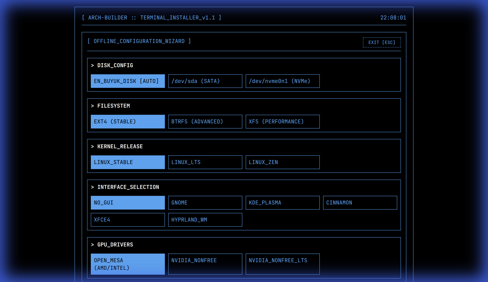
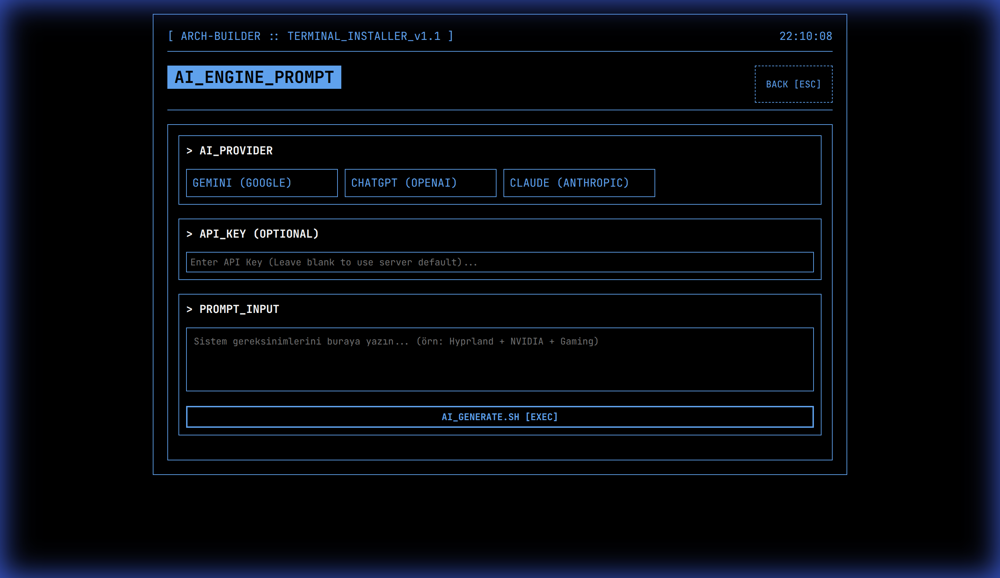

# 🏗️ ARCH-BUILDER v1.1 [TUI-READY]

**ARCH-BUILDER**, Arch Linux kurulum sürecini otomatize eden ve modern bir TUI estetiğiyle sunan gelişmiş bir script oluşturma platformudur.

---

## 📸 Arayüz Görüntüleri

Projeyi çalıştırmadan önce arayüze göz atın:

### Ana Menü


### Diğer Ekranlar

| Manuel Yapılandırma (Başlangıç) | Manuel Yapılandırma (Seçimli) |
| :---: | :---: |
|  |  |

| AI Modu | Yapılandırılmış Sihirbaz |
| :---: | :---: |
|  |  |

### 🎨 Örnek: ARCH-BUILDER ile Kurulmuş Sistem


*ARCH-BUILDER kullanılarak kurulmuş Hyprland masaüstü (Örnek Rice)*

---

## 🚀 Temel Özellikler

1.  **Backend'i Hazırlayın:**
    ```bash
    cd backend && npm install
    cp .env.example .env # API anahtarlarınızı ekleyin
    node server.js
    ```
2.  **Frontend'i Açın:** `frontend/index.html` dosyasını tarayıcınızda açın.

---

## 📚 Detaylı Dökümantasyon

Şu an ana dökümantasyon dosyasındasınız. Diğer önemli kaynaklar:

-   🏗️ **[Teknik Mimari (Architecture)](ARCHITECTURE.md)**: AI çalışma mantığı, fallback mekanizmaları ve proje yapısı detayları.
-   ❓ **[Sıkça Sorulan Sorular (FAQ)](FAQ.md)**: Genel sorular ve yanıtları.

---

## ⚠️ Uyarı
Üretilen scriptler sisteminizi formatlayabilir. Çalıştırmadan önce içeriği kontrol etmeyi unutmayın.

**Developed with ❤️ for Arch Linux Users.**
